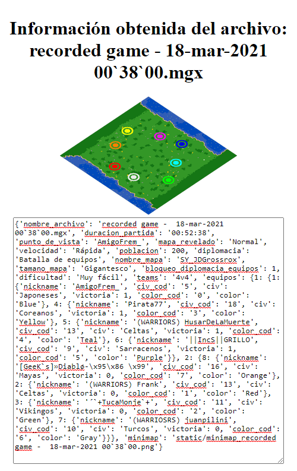

# recgame-info

## Description
Website to analyze AoE2 recgames.

## Using
- Install Python3
- Install Flask `pip install flask`
- Install mgz `pip install mgz`
- Install Pillow `pip install pillow`

- Run flask `flask run` **or** `python app.py`
- upload AoE2 recgames:
  - .mgl
  - .mgx
  - .mgz

## Using the API
You could get all the info scanned going to this url [/get_data](localhost:5500/get_data).

## Screenshots

**Go to 'search file'**

**Upload a file and press 'SUBIR'**

**HERE YOU HAVE!**

## Special thanks.
- GoFullPage (version 7.5)
- Python3
- HappyLeavesAoE